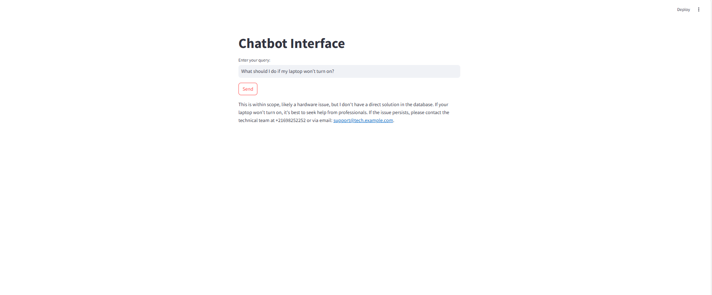

# 🛠️ ITHelper-AI-Incident-Resolution-Assistant

## 🚀 Overview

ITHelper is an AI-powered assistant designed to streamline IT incident resolution. Leveraging the power of LlamaIndex and Mistral LLM, it efficiently handles IT-related queries, providing quick and accurate responses for technical issues involving drones, networking, hardware, and software.

## 💡 Key Features

* 🌐 **Language Detection**: Automatically detects and responds in English or French.
* 🤖 **IT Specialist Role**: Acts as an expert in IT incidents and technical tasks.
* 🔧 **Intelligent Interpretation**: Corrects typos and ambiguous queries.
* 🗃️ **Context-Aware Responses**: Uses a CSV knowledge base for precise answers.
* 📝 **Customizable Prompt**: Fine-tuned for IT-specific language and classification.

## 🧩 Tech Stack

* 📝 **FastAPI**: RESTful API for chatbot interaction.
* 🦙 **LlamaIndex**: Mistral LLM for natural language understanding.
* 📂 **ChromaDB**: Vector database for efficient context retrieval.
* 🐼 **Pandas**: Data processing and CSV handling.
* 🪶 **HuggingFace Embedding**: Text embeddings for similarity search.

## 📦 Installation

1. Clone the repository:

   ```bash
   git clone https://github.com/yourusername/ITHelper-AI-Incident-Resolution-Assistant.git
   cd ITHelper-AI-Incident-Resolution-Assistant
   ```
2. Install dependencies:

   ```bash
   pip install -r requirements.txt
   ```

## ⚙️ Usage

Start the FastAPI server:

```bash
uvicorn main:app --reload --host 0.0.0.0 --port 8001
```

Access the API at:

```
http://localhost:8001/docs
```

## 💬 Example Query

POST request to `/api/chat` with JSON body:

```json
{
  "query": "How to fix a WiFi problem?"
}
```

Response:

```json
{
  "response": "This is likely a software issue. Please check your network settings."
}
```




